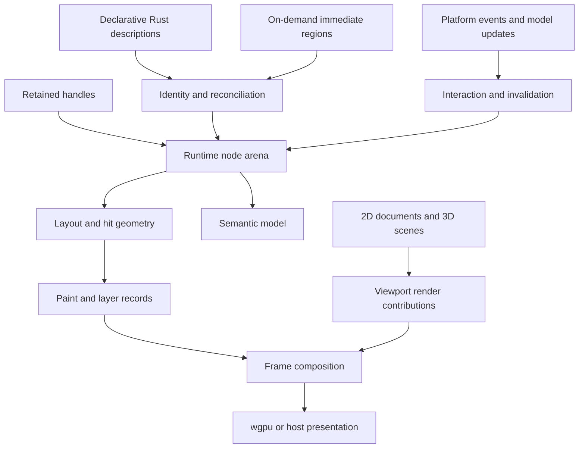

# Runtime architecture

Status: selected runtime baseline P-01/P-02/P-03/P-07/P-13/P-21/P-22. Revision: 0.4.

## Shared runtime, separate responsibilities

Retained, declarative, and immediate describe how applications express changes. They do not determine whether geometry or pixels must be regenerated. view should separate construction, interaction, layout, painting, and presentation.

The runtime node hierarchy is authoritative for UI ownership. Derived layout, semantic, hit-test, and render structures may differ in shape and update cadence. A large document or 3D scene is not required to become a node per object in that hierarchy.

## Logical module boundaries

These are responsibilities, not a commitment to one Cargo crate per row:

| Module | Owns | Dependency direction |
| --- | --- | --- |
| Core | Identity, transactions, lifecycle, input model, semantics | No platform window, network transport, or wgpu types required |
| Authoring | Views, reconciliation, retained handles, immediate regions | Core |
| Layout/text | Measurement, arrangements, text service interfaces | Core; selected text/layout implementations |
| Graphics | Paint/layer records and render-provider contracts | Core; GPU-specific boundary in backend adapter |
| wgpu backend | Devices, resources, encoding, surface composition | Graphics and wgpu |
| Platform | Windows/events/native services and later OS adapters | Core plus platform libraries; integrates selected backend |
| Tools | Tests, inspection, protocol, CLI/MCP | Public runtime/diagnostic interfaces; optional dependencies |
| Feature modules | Canvas/scene helpers, widgets, docking, document services | Supported core/graphics/platform interfaces |

The public view facade can select sensible modules. An embedded host can select the pieces it needs. Avoid both a compulsory monolith and dozens of tiny crates before compile-time and maintenance costs are understood.

## Authoring modes

| Mode | Owner action | Persistent runtime output |
| --- | --- | --- |
| Retained | Create nodes/components once; mutate through validated handles | Identity, properties, state, derived records |
| Declarative | Produce descriptions from state when invalidated | Reconciled instances and their state |
| Immediate widgets | Execute scoped declarations and consume responses on demand | Identity, interaction state, last declarations |
| Immediate drawing | Record 2D drawing commands when invalidated | Last command list and optional semantic/hit regions |
| Continuous viewport | Render on its own frame demand | GPU state, scene state, last compositable output |

All share focus, capture, clipping, coordinate conversion, and semantic contracts. Each subtree has exactly one structural owner. A retained component mounted inside an immediate region keeps its own children; the enclosing region owns only the mount's presence and placement.

## Identity and lifetime

Proposal: an arena addressed by index plus generation, with separate stable application keys. A node handle is not a persistent document identifier, test selector, or cross-process address.

Reconciliation matches parent scope, explicit key, and component type. Changing type resets incompatible local state. Duplicate sibling keys are diagnostic errors. Reordered lists use document/item keys rather than positions.

Missing declarations remove nodes only when the owning region actually runs. Skipping a clean region preserves it. Hidden, clipped, suspended, and unmounted are distinct lifecycle states. Resource cleanup and cancellation follow unmount; visibility alone does not erase editing state.

Removal cancels pointer capture, resolves focus, handles active IME composition according to a documented policy, cancels owned work, and withdraws semantic nodes. Cross-window movement preserves application document state and remounts view-local state by default; explicit typed snapshots can restore selection/scroll. Focus, capture and composition resolve through platform lifecycle rather than transferring live native sessions implicitly.

## State and effects

Application documents and scene models remain application-owned. The runtime owns focus, capture, interaction responses, layout caches, and component-local UI state. Shared data is accessed through explicit handles or subscriptions; arbitrary mutable memory changes cannot be automatically observed.

Standard controls reuse behavior engines with explicit text/selection/composition/history ownership. Styling a control cannot silently replace its interaction contract. A runtime add-on may own a namespaced UI description, but host-owned control sessions keep local interaction responsive and enforce the same semantics as application controls. Domain changes remain application-owned commands.

Start with typed actions and explicit revisions/invalidation. Explore tracked reads only after the API examples show a real benefit. Declarative builds and measurement are pure with respect to application effects. Immediate update callbacks may consume events once; they are never rerun merely to measure.

Commands that save files, send network requests, or modify document history are issued through an effect/action boundary. Build retries cannot repeat them. Async completions carry an owner generation and request revision; obsolete results are discarded, cancelled, or reconciled explicitly.

Network-driven loading/error/content branches use ordinary Rust control flow over that state. Cancellation is not a replacement for stale-result validation, and retaining a key does not retain an already unmounted branch. Transport/executor adapters stay outside core; future portable completion APIs can accommodate browser-local tasks without restricting native providers. See the [network state contract](11-network-ui-and-web.md).

## Event and commit contract

1. Normalize platform input with window identity, coordinates, timestamp, and sequence number.
2. Route against the latest committed hit geometry, or to the captured/focused target.
3. Record interaction transitions and actions exactly once.
4. Apply model changes and rebuild invalidated regions.
5. Resolve dependent layout and update paint/hit/semantic records.
6. Publish a coherent commit revision; present when a frame is demanded.

Process ordered input without losing press/release transitions. Before routing a later geometry-dependent event, flush any required pending commit. A newly mounted widget becomes hittable only after commit. Expose the committed versus presented revision to automation; they may differ while the GPU is busy.

Pointer coordinates are transformed through window logical space, UI transforms, viewport space, and optionally scene space. Screen coordinates remain a separate platform concern. Modal scopes and pointer capture take precedence over ordinary hit testing. Keyboard focus and 3D scene selection are distinct.

## Invalidation contract

| Dirty category | Typical cause | Work |
| --- | --- | --- |
| Build | Model revision, consumed action | Execute description/immediate region |
| Layout | Constraints, text metrics, children | Measure and arrange affected dependencies |
| Paint | Color, image content, decoration | Regenerate affected commands |
| Composite | Transform, clip, eligible opacity | Recompose layers; may require a new render target |
| Semantics | Label, role, value, focus | Publish semantic changes |
| Viewport | Camera, scene, continuous animation | Run relevant GPU contribution |

Dependencies propagate across size-affecting ancestor/sibling relationships. A layout boundary must have explicit constraint guarantees. Scroll and transforms may alter hit geometry and semantics even when paint commands remain reusable.

Group opacity is not always equivalent to changing each child's alpha. The renderer decides whether an isolated layer is required. Dirty flags are causes, not promises that a specific optimization is legal.

## Scheduling and concurrency

Proposal: one UI owner thread initially, with workers for appropriate background jobs. Rendering consumes a coherent prepared snapshot. A dedicated render thread remains a measured optimization; it is not required for native performance.

Separate simulation ticks, viewport frame requests, UI rebuilds, and window presentation. A 120 Hz viewport can coexist with an idle inspector. Coalesce redundant requests per window; retain input order. Hidden/minimized windows reduce or suspend rendering according to policy while required document work continues.

Use bounded producer queues and latest-result policies for replaceable previews. Critical actions cannot be silently dropped. Tooling requests enter the same owner-thread transaction queue rather than mutating the tree from an IPC thread.

Framework-owned and application-owned loops use the same runtime transactions. The host owns one authority for event pumping and presentation; two competing event loops are not a supported integration pattern.

## Failure behavior

Stale handles return a defined failure or debug diagnostic. Unsupported platform/GPU capabilities are reported at negotiation. Device recreation invalidates device-bound caches; extension resource providers participate in recovery. Fatal allocation/device failures are surfaced to the application rather than promising universal recovery.

The release pipeline must exercise identity reuse, deletion during capture, async completion after unmount, immediate-region skipping, repeated layout, and mixed viewport/UI scheduling. See [delivery and validation](08-delivery-and-validation.md).

Panic/crash reporting is an opt-in host integration. It must not install global behavior implicitly or resume an inconsistent tree after catching a panic. Document recovery is based on healthy-operation checkpoints, independently of crash reporting. See [diagnostics policy](12-diagnostics-and-crash-policy.md).

Runtime extensions have a separate generation/lifecycle from widget nodes. Deactivation revokes commands, cancels requests, resolves focus, and retires resources before destroying execution state. Different process/VM/native routes have different failure and trust properties; see [runtime add-ons](14-runtime-addons.md). Ordinary source control crates need none of this machinery.
