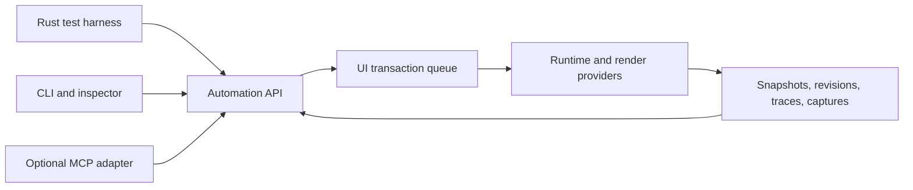

# Automation and developer tooling

Status: selected R-11 tooling baseline; P-08/P-09/P-17/P-18/P-19/P-21/P-22. Revision: 0.4.

## Automation boundary

Provide one versioned command/query model over the runtime. Rust tests, a CLI, an inspector, and an optional MCP adapter use it. The protocol operates on public semantic and diagnostic contracts, not memory addresses or private widget fields.



An external adapter is a transport, not an alternate interaction implementation. MCP can be implemented with the official Rust SDK in an optional tooling package. The base framework must not require its async/network stack. [MCP Rust SDK](https://github.com/modelcontextprotocol/rust-sdk)

## Discoverable capabilities

On attachment, return protocol version, session/window IDs, supported operation versions, enabled platform/render capabilities, and extension descriptors. Negotiate optional operations explicitly.

A widget/render extension descriptor may publish semantic roles, inspectable properties, typed actions, test hooks, and supported snapshot schemas. This is runtime capability discovery, separate from deciding how binary plugins are loaded.

Missing capabilities produce structured errors. A backend must not claim input injection or screenshots when it can only invoke application actions.

## Application-integrated MCP

Developers should be able to enable an application automation module and register domain commands beside generic view tools. This supports Blender-style domain workflows without requiring applications to expose private Rust objects or provide a generic eval operation.

An illustrative, unimplemented integration is:

```rust
let automation = Automation::new()
    .with_view_tools()
    .command("scene.select", select_schema(), handlers::select)
    .command("document.undo", undo_schema(), handlers::undo)
    .command("render.preview", preview_schema(), handlers::preview);

// The application explicitly enables/configures its optional transport.
app.install_automation(automation, transport_config);
```

One adapter can run in-process; an optional sidecar can translate MCP to a local app protocol. The sidecar cannot directly access Rust memory: commands still enter the application's dispatcher. A namespace separates framework operations from application/provider operations. Discovery supplies schemas, descriptions, compatibility versions, supported targets, and actual capabilities.

MCP supports discoverable tools and JSON-schema-described inputs, with tool results and error signaling. Domain behavior, mutation permissions, undo, and transaction guarantees remain application contracts; MCP alone does not supply them. [MCP tools specification](https://modelcontextprotocol.io/specification/2026-07-28/server/tools)

Commands define target identity, argument validation, read/mutate scope, preconditions, cancellation, result schema, and affected model/commit revisions. Long work returns an operation ID with status/progress queries. Ordinary commands execute through the same action/effect machinery as UI actions. Batch transactions are offered only where atomicity or rollback is genuinely implemented.

Within a negotiated live session, mutation request IDs can be deduplicated to avoid applying an undo or destructive edit twice after a retry. Across process restarts or ambiguous disconnects, return unknown outcome unless the application persists the required operation record. Never promise network-level exactly-once effects merely because the tool API is typed.

The app can group commands into scoped profiles: inspect-only, document editing, render control, test input, or an explicitly enabled scripting facility. A scripting facility, if ever supplied, is separately authorized by the host and is not necessary for complex automation. Applications choose authentication, attachment, and command policy; arbitrary web content cannot call the privileged bridge.

Framework and domain tool tests verify discovery, argument rejection, stale targets, owner-thread execution, undo grouping, async completion, and reconnect behavior. A semantic tool such as scene.select is labeled as an application command; it does not substitute for testing selection through pointer input.

Runtime add-ons contribute namespaced panels/actions through the host's granted interfaces; they are not automatically entitled to expose new privileged MCP tools. The host can publish permitted extension commands and actual supported profiles. Public control metadata and version-matched examples may also be served through read-only discovery tools to reduce invented API usage by human/AI clients.

## Queries, actions, and synchronization

| Operation family | Proposed examples | Contract |
| --- | --- | --- |
| Discover | capabilities, windows, extension schemas | Versioned and stable enough for clients |
| Inspect | semantic tree, bounds, layout, focus, capture, dirty causes | Coherent revision-tagged snapshots |
| Select | role/name, test ID, ancestor scope, semantic document ID | Ambiguity is an error unless explicitly requested |
| Physical input | pointer, scroll, key transitions, text/IME test paths | Enters the declared input layer |
| Semantic action | activate, set value, select scene object | Does not claim to test physical hit routing |
| Synchronize | await predicate, await commit, await presentation, advance test time | Bounded and explicit |
| Capture | window/viewport image, semantic diff, frame diagnostics | Content revision and provenance recorded |
| Diagnose | input trace, invalidation trace, resource stats | Bounded overhead and retention |

Selectors resolve against a snapshot; actions validate the current target generation and relevant revision. Reject stale targets or re-resolve according to an explicit policy. Never click another object merely because an arena slot was reused.

Commit means runtime state is coherent. Presentation means the requested render revision reached the defined presentation boundary. GPU submission alone is not proof that an OS compositor displayed the frame. Report the boundary actually observed.

“Wait until idle” is scoped to finite pending work and excludes declared continuous producers. Predicates and revision waits are the primary synchronization mechanism. Timeouts return diagnostics instead of an unexplained hang.

## Test tiers

| Tier | Exercises | Important limitations |
| --- | --- | --- |
| Runtime headless | Reconciliation, actions, layout, focus, semantics, controlled scheduling | No GPU or OS behavior |
| Offscreen wgpu | Real shaders, clipping, blending, glyphs, scene composition, readback | No native window interaction |
| In-process window | Platform adapter and runtime with controlled events | Injection may bypass physical OS paths |
| Native E2E | Actual OS input, windows, IME/services, accessibility | Needs suitable interactive desktop infrastructure |

All tiers matter. A semantic Activate is not a pointer click, a test text event is not full IME integration, and an offscreen image is not a compositor screenshot. Test reports must label which path was exercised.

## Optional desktop input driver

Yes: propose a test mode that opens the actual E2E application window, takes an explicitly enabled desktop input session, and drives the real mouse cursor and keyboard. A Rust test, CLI, or MCP client can request the same operations. Default headless/in-process tests do not take over the desktop.

The runner launches or attaches to the configured test process/window and verifies the active target before each input group. Use a dedicated unlocked desktop/session for CI, one input-owning test at a time, a stop mechanism, bounded timeouts, and tracking/release of keys or buttons pressed by the runner. Abort on target closure or unexpected focus loss; do not silently type into another application. Do not release keys the runner did not press. A local developer explicitly opts into cursor/keyboard control for that session.

On Windows, SendInput can synthesize mouse/keyboard input, but it is subject to integrity restrictions and does not clear existing keyboard state. The driver must report inaccessible/elevated targets and environment interference rather than claiming successful delivery. [Windows SendInput](https://learn.microsoft.com/en-us/windows/win32/api/winuser/nf-winuser-sendinput)

Do not work around secure desktops or OS restrictions. A browser-hosted view app cannot itself take global desktop input control; external native/browser automation supplies the appropriate test tier.

## Hit-test and scroll validation

Framework geometry is valuable for finding candidate input coordinates, but it cannot be the only source of expected correctness. The actual OS-delivered target, resulting application behavior, and rendered/reference geometry provide additional evidence.

For a physical target action, the driver:

1. Resolves a stable selector in the chosen window/provider and records the commit/layout revision.
2. Locates the scroll ancestors and requests realization of virtual content if necessary. Test setup realization is labeled separately from user-input scrolling.
3. Computes the target's visible region through transforms and clip intersections, accounting for enabled state, overlays, and hit-test policy. A bounding-box center is insufficient for clipped or irregular content.
4. Chooses an actionable point and converts local coordinates to client logical/physical and current screen coordinates using platform transforms. Account for window movement, decorations, DPI, and the virtual desktop origin.
5. Rechecks revisions and foreground target before sending actual mouse/key events. If the layout changed, resolve again within a bounded retry policy.
6. Observes the routed target, focus/capture transitions, action receipt, and relevant committed/presented output. Input insertion alone is not success.

Provide two separate scroll operations: semantic ensure-visible for setup, and physical wheel/trackpad-style/keyboard gestures for testing. The latter positions the pointer or establishes keyboard focus as appropriate, sends bounded input, waits for measured movement/realization, then recomputes geometry. It must not secretly assign the scroll offset when claiming a physical-scroll pass. Precision touchpad-specific behavior requires an appropriate injection/hardware fixture rather than pretending every wheel event is a touchpad gesture.

The suite covers nested scrollers, inner boundaries and configured scroll chaining, clipped/offscreen/disabled/occluded controls, overlays, horizontal scrolling, scrollbar dragging, virtual rows, transformed canvases, fractional DPI, mixed monitors, and layout changes during an interaction. Non-actionable targets fail with the clip/occlusion/geometry chain; no guessed click is emitted.

Add small analytic fixtures with independently specified expected regions/offsets, pixel/golden checks where appropriate, and metamorphic checks such as moving/scaling a window while preserving the same logical target. This reduces the risk that a layout bug and the test locator agree on the same wrong answer. Native accessibility observations can supply another independent path where supported; they are not assumed to expose every canvas object.

## Keyboard-focused E2E suite

Test logical focus order and actual focus transitions through Tab/Shift-Tab, skipped disabled/hidden controls, Enter/Space activation, arrow navigation, Home/End/PageUp/PageDown, shortcut scopes, modifier release, command palette, modal focus containment/restoration, Escape cancellation, capture loss, and switching between windows or embedded content.

Text tests distinguish physical keys, Unicode text insertion, and native IME composition. Key-to-text mapping is locale/layout dependent; an ASCII key injection test is not Unicode or IME coverage. IME candidate/commit/cancel behavior needs native integration fixtures with the input method/environment recorded.

A representative workflow starts with keyboard navigation, focuses a nested scrollable inspector, pages to a virtual field, edits it, opens and dismisses a modal, verifies focus restoration, uses a shortcut to undo, then validates the scene/canvas output. A pointer variant finds and scrolls to the same field from framework geometry. Reports retain both expected and actual focus/target chains.

Standard-control conformance profiles turn these general capabilities into reusable tests, including deletion, selection, undo, and native text/IME behavior. Community crates and host-rendered add-on panels use the same applicable suite; results distinguish passed, failed, uncovered, and not applicable. See [control profiles](13-controls-and-conformance.md).

## Determinism and replay

Inject a clock into timers/animation and fixtures into platform/application services. Record seeds, font/assets, viewport/DPI, theme, dependency versions, adapter/backend, and relevant external completions. Asynchronous resource loading is either controlled or explicitly awaited.

An input-only trace cannot reproduce arbitrary network, filesystem, or worker timing. Replay records or substitutes those boundaries. A continuously running scene must offer test clock control or clearly report that deterministic scene replay is unavailable.

Visual tests use fixed inputs and bounded comparison tolerances. Separate structural assertions from pixels so a small raster difference does not obscure a wrong selection or focus target. Golden updates are reviewable changes with before/after artifacts; they are never automatically accepted after failure.

## 2D/3D automation

Canvas providers expose document coordinates and semantic items; scene providers expose named/object identifiers and supported actions where meaningful. Tools can inspect selection, manipulate a camera, or drag a gizmo through physical input. Direct SetTransform is useful but does not validate a gizmo drag.

GPU picks and captures return asynchronously with scene/camera/frame revisions. Screenshot capture may require readback and can perturb frame timing. Performance runs disable intrusive capture except on failure or explicitly separate its overhead.

Custom rendering that supplies no semantic information remains inspectable as a viewport with declared bounds/capabilities. It must not falsely advertise accessible internal objects.

## Developer iteration features

Propose a component gallery, state fixtures, a tree/layout inspector, clipping and hit-test overlays, a “why updated” view, GPU/resource counters, and portable failure bundles. Use the same contracts as external automation to avoid a privileged second tooling API.

Theme/assets can reload through versioned resources. Fast restart with optional application-provided state restoration is a separate capability. Arbitrary stateful Rust code reload is deferred; its ABI, compilation, lifetime, and migration requirements are not solved by a builder syntax.

Debug tooling is opt-in. Release applications can omit external transports and sensitive diagnostics. External attachment is explicitly enabled, scoped to the intended session, and authenticated when applicable. Do not expose arbitrary code execution as a default automation operation. These controls support shipping software and do not impose approval prompts on ordinary local tests.

## Acceptance scenario

A test discovers a scene viewport and its inspector, selects an object through pointer input, drags a gizmo, verifies the inspector value, performs undo, checks restored scene state, and captures the result. Repeat through the Rust harness and an external adapter using the same operation semantics. Add a semantic-action variant but report it separately.

Failure artifacts include the operation history, selected IDs, committed/presented revisions, tree snapshot, input/capture/focus state, render capabilities, and a bounded resource/invalidations summary. This workflow should be available early enough to help build the remaining framework.
